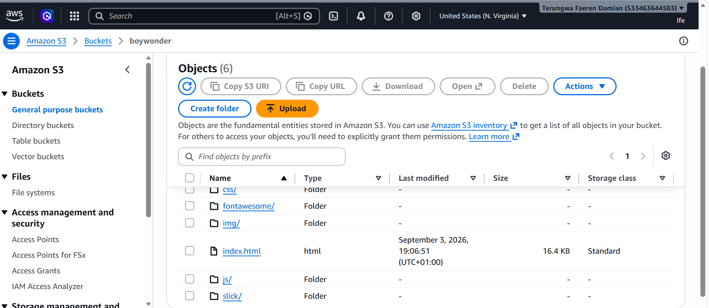

# Hosting a Static Website with AWS S3
This documentation demonstrates how I practiced hosting a static website using **Amazon S3**. At the end of this setup, a static website is available publicly through an S3 endpoint.
# Step-By-Step Setup
1.	The first thing I did was to create an S3 Bucket on my AWS Console. Below are the steps i took to create the bucket;
•	Logged into my AWS Management Console
•	Searched for S3
•	Clicked on Create Bucket
•	Selected the Bucket type
•	Entered a unique bucket name
•	Selected a region
•	Disable Block all public access (This enabled the accessibility of the static website over the internet).
Named the bucket “boywonder”

2.	Uploading Website Files
I downloaded a Website template, extracted the files from the zipped folder and uploaded the files into my bucket.

3.	Enabling Static Website Hosting
After uploading my objects in the bucket, I went ahead to enable static website hosting.
I scrolled down to Static website Hosting in the Properties Section. I enabled it and set: Index document index.html (HTML Document) and Error document error.html (optional)

