# Hosting a Static Website with AWS S3
This documentation demonstrates how I practiced hosting a static website using **Amazon S3**. At the end of this setup, a static website is available publicly through an S3 endpoint.

# Step-By-Step Setup
1. The first thing I did was to create an S3 Bucket on my AWS Console. 
Below are the steps i took to create the bucket;

•	Logged into my AWS Management Console

•	Searched for S3

•	Clicked on Create Bucket

•	Selected the Bucket type

•	Entered a unique bucket name

•	Selected a region

•	Disabled **Block all public access** (This enabled the accessibility of the static website over the internet).

Named the bucket “boywonder”

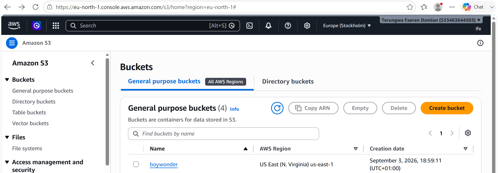

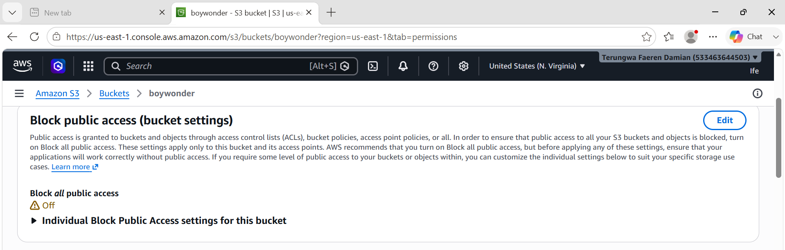

2. **Uploading Website Files**

I downloaded a Website template, extracted the files from the zipped folder and uploaded the files into my bucket.

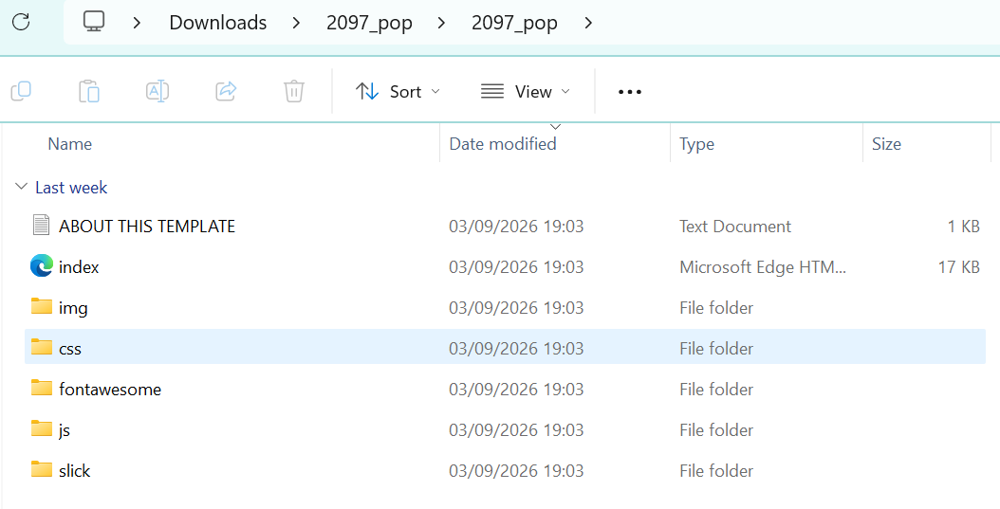

3. **Enabling Static Website Hosting**

After uploading my objects in the bucket, I went ahead to enable static website hosting.

I scrolled down to Static website Hosting in the Properties Section.Enabled it and set:

Index document index.html (HTML Document)and 

Error document error.html (optional)

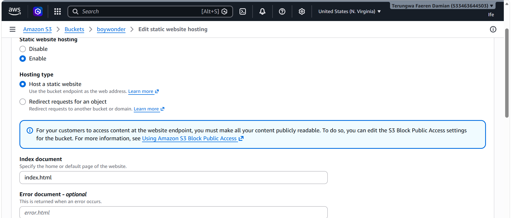

4. Added my Bucket policy in the permissions section to provide public accessibility to the objects in the bucket. [View Policy](Policy.txt)

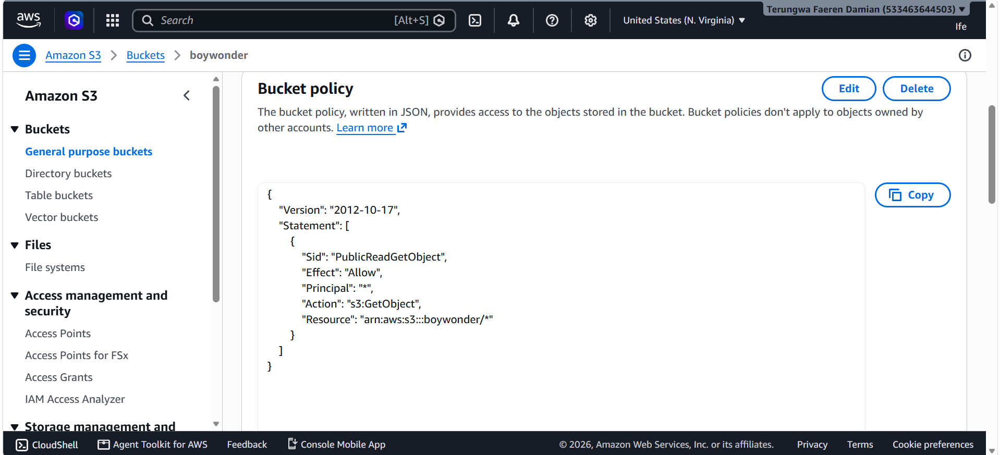

5. Static website stored and hosted! Below is the index page opened on my edge browser directly from my console.
Endpoint URL for my website: [View Live Website](https://boywonder.s3.us-east-1.amazonaws.com/index.html)

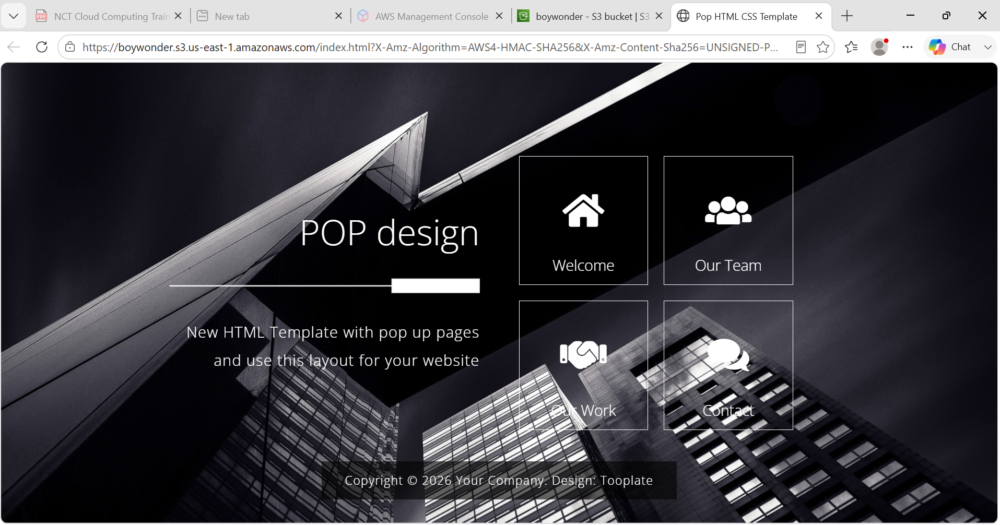

# Delivering my Static Website Globally using CLOUDFRONT
This documentation shows the step by step process on how I delivered the static website in my bucket globally. At the end of this setup, my static website will be delivered publicly over the internet.

# Step-By-Step Setup
1. The first thing I did was to create a Distribution. Here are the steps I took to create the Distribution.
•	Searched for Cloudfront
 
•	Clicked on Create Distribution

•	Followed all the steps to create a Distribution on the console. 
The steps includes;
 
•	Get started- at this step, I named my distribution and selected the distribution type.

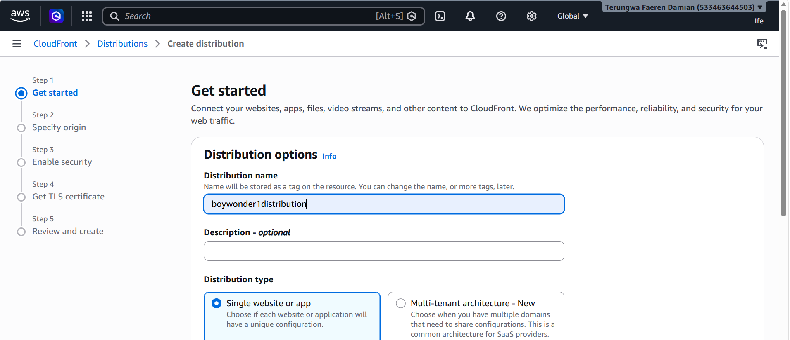

• Specify origin- at this step I selected my origin type (Amazon S3). 
I also entered my Origin which is my bucket “boywonder” because that’s where the static website is stored.

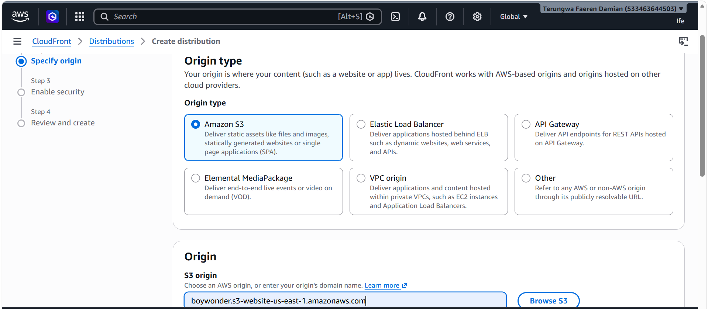

• Enable security- at this step I enabled WAF for security on my website

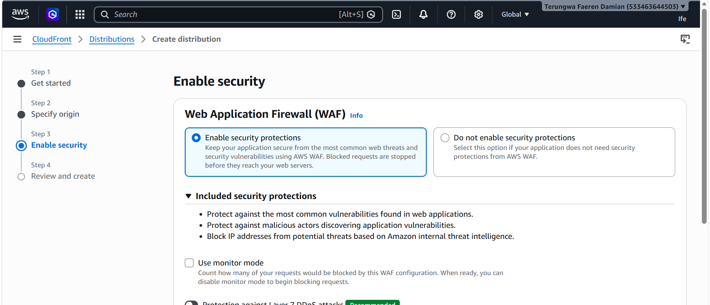

• Review and Create- at this step which is the final step, I reviewed all my selections and finalized creating the Distribution.

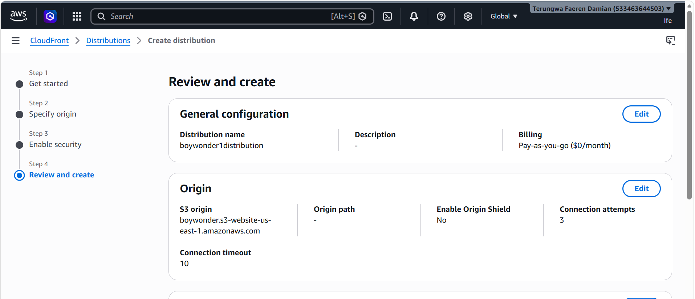

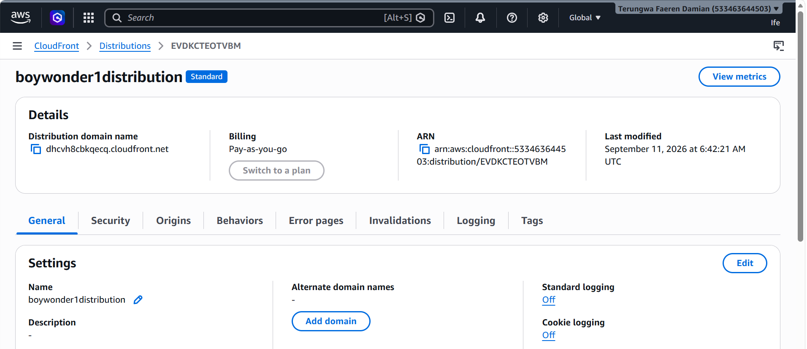

2. Tested the website by copying domain and pasting in another browser.
The static website opened in the new browser securely.
[Domain](https://dhpf8vg6lmevp.cloudfront.net)

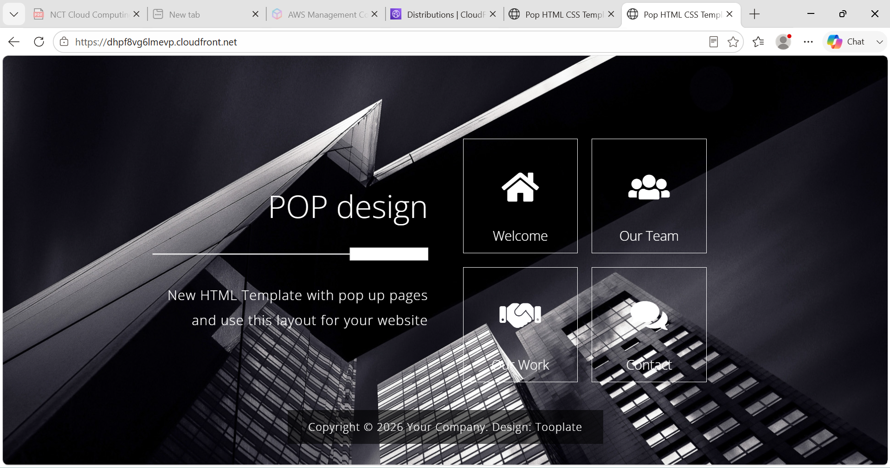

